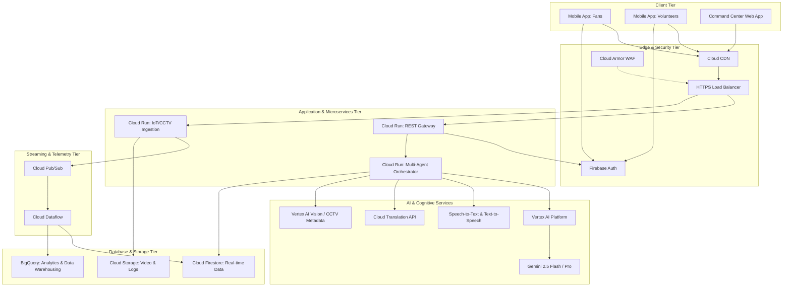
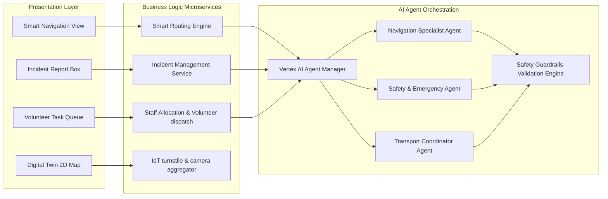
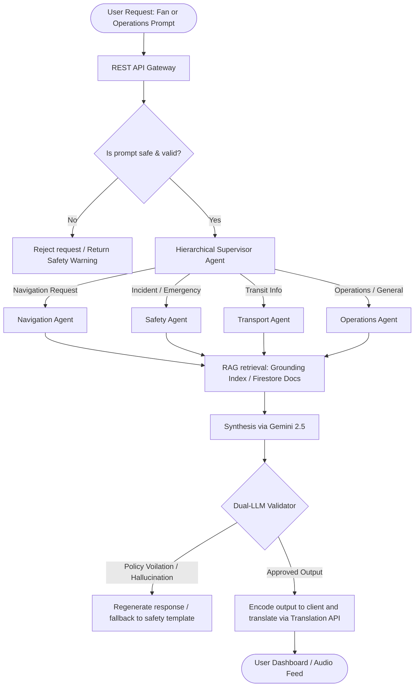
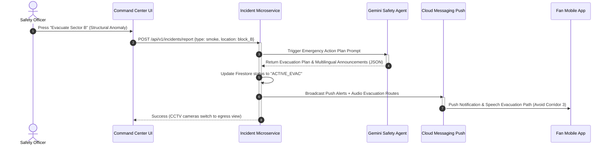
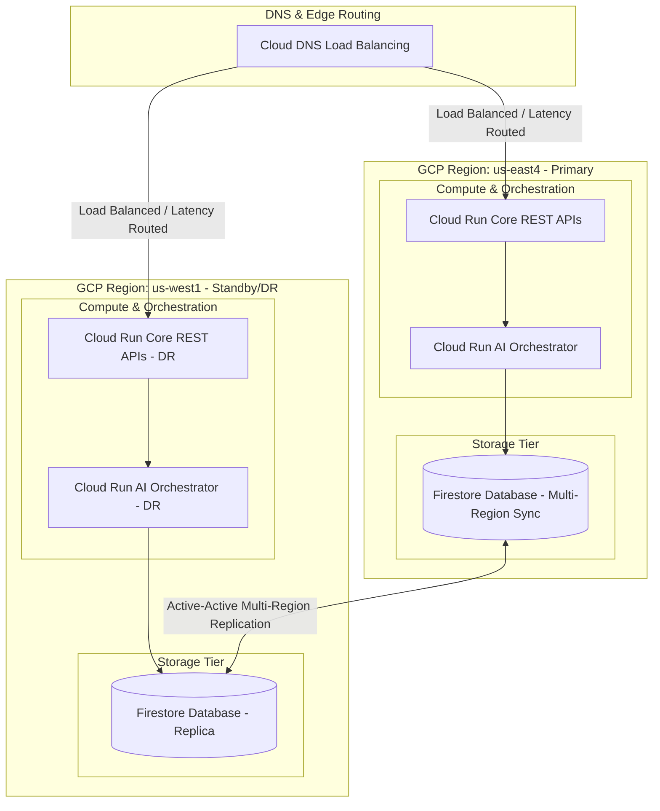

# StadiumMind AI - Systems Architecture

This document describes the systems, components, event flows, and deployment architectures for **StadiumMind AI**. The platform is built on Google Cloud Platform (GCP) and uses a multi-agent generative AI structure.

---

## 1. High-Level System Architecture

The solution uses a serverless, event-driven architecture to scale to millions of concurrent fans and thousands of operations staff.



### Why Google Cloud Serverless?
- **Cloud Run**: Scales to zero and spins up instantly to handle match-day spikes. Trade-off: cold starts are minimized by maintaining a minimum instance count of 1 during matches.
- **Firebase Auth & Firestore**: Real-time listeners enable volunteer updates and incident triggers to push to clients without expensive WebSocket infrastructure management.
- **Cloud Pub/Sub**: Acts as a buffer for millions of events per second from IoT tickets, turnstiles, and beacons.

---

## 2. Component Diagram



---

## 3. Data Flow

```mermaid
sequenceDiagram
    autonumber
    participant CCTV as CCTV Camera / Turnstile
    participant Ingest as Cloud Run Ingest API
    participant PubSub as Cloud Pub/Sub
    participant Dataflow as Cloud Dataflow
    participant Firestore as Firestore (Real-Time)
    participant BigQuery as BigQuery (Analytics)
    participant OpsUI as Operations Command Center

    CCTV->>Ingest: Send occupancy metadata (JSON payload)
    Ingest->>PubSub: Publish telemetry event
    PubSub->>Dataflow: Stream payload window
    Dataflow->>Firestore: Upsert live sector count (e.g., Gate 4: 92% density)
    Dataflow->>BigQuery: Append historical record for drift analysis
    Firestore->>OpsUI: Push real-time document update (WebSocket/Reactive listener)
    Note over OpsUI: Dashboard marks Sector Red; triggers alert
```

---

## 4. Multi-Agent AI Workflow



---

## 5. Sequence Diagram: Emergency Event Evacuation

The sequence below demonstrates how the system reacts in real time to a reported safety hazard (e.g., structural smoke detection in Sector B).



---

## 6. Deployment Architecture

StadiumMind AI is deployed multi-region to ensure maximum reliability and sub-second latency across all 20 venues.



### Trade-offs & Decisions
1. **Active-Active vs. Active-Passive**: Firestore supports active-active setups natively across multi-region configurations, ensuring zero database down-time. 
2. **Cloud Armor Defense**: Integrated with Cloud Armor to prevent DDoS and API scraping attacks from fans trying to bot tickets or concession systems.
3. **Regional Failover**: In the event of a total GCP region outage, DNS instantly redirects all API requests to the secondary standby region within 4 seconds.
